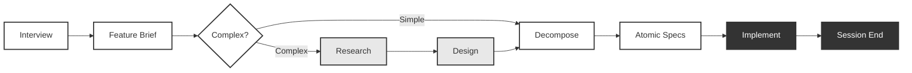

# Joycraft

<p align="center">
  
</p>

> The craft of AI development. With joy, not darkness.

## What is Joycraft?

Joycraft is a CLI tool that installs structured development skills into [Claude Code](https://docs.anthropic.com/en/docs/claude-code), [OpenAI Codex](https://openai.com/codex), and [Pi](https://github.com/earendil-works/pi-coding-agent), along with behavioral boundaries, templates, and documentation structure. It takes any project from unstructured prompting to autonomous spec-driven development — and on Pi, to fully headless spec execution.

### The core idea

- **Levels 1-4:** Skills like `/joycraft-tune`, `/joycraft-new-feature`, and `/joycraft-interview` replace unstructured prompting with spec-driven development. You interview, you write specs, the agent executes.
- **Level 5:** The `/joycraft-implement-level5` skill sets up the autonomous loop where specs go in and validated software comes out, with holdout scenario testing that prevents the agent from gaming its own tests.

### What are the levels?

[Dan Shapiro's 5 Levels of Vibe Coding](https://www.danshapiro.com/blog/2026/01/the-five-levels-from-spicy-autocomplete-to-the-software-factory/) provides the framework:

| Level | Name | What it looks like | Joycraft's role |
|-------|------|--------------------|-----------------|
| 1 | Autocomplete | Tab-complete suggestions | - |
| 2 | Junior Developer | Prompt → iterate → fix → repeat | `/joycraft-tune` assesses where you are |
| 3 | Developer as Manager | Your life is reviewing diffs | Behavioral boundaries in CLAUDE.md |
| 4 | Developer as PM | You write specs, agent writes code | `/joycraft-new-feature` + `/joycraft-decompose` |
| 5 | Software Factory | Specs in, validated software out | `/joycraft-implement-level5` sets up the autonomous loop |

Most developers plateau at Level 2. Joycraft's job is to move you up.

### Platform support

Joycraft supports **Claude Code**, **OpenAI Codex**, and **Pi** out of the box. Running `npx joycraft init` auto-detects which harnesses your project uses and installs the matching skills — no flags, no configuration:

| Harness | Skills installed to | Invocation |
|---------|---------------------|------------|
| Claude Code | `.claude/skills/` | `/joycraft-*` |
| Codex | `.agents/skills/` (+ `AGENTS.md`) | `$joycraft-*` |
| Pi | `.pi/skills/` (+ pipeline runtime, see below) | `/skill:joycraft-*` |

All three get the same structured workflows, adapted for each tool's invocation model. Codex and Pi surfaces install when their directory (`.agents/` or `.pi/`) is present in the project.

### Headless spec execution (Pi)

Pi is the one harness where the workflow can run **fully autonomously** — no human keystrokes between specs. Beyond the skills, `init` installs a pipeline runtime to `.pi/scripts/joycraft/` whose driver, `joycraft-implement-loop`, runs an entire feature's spec queue end to end:

```
next-spec → pi -p "/skill:joycraft-implement <spec>" → pi -p "/skill:joycraft-spec-done <spec>" → repeat
```

Each spec runs in **one fresh OS process** (`pi -p`), so the context isolation is the process boundary itself — verified, not in-conversation trickery. The loop is fail-fast (stops and names the failing spec) and runs `session-end` exactly once when the queue is exhausted.

This is what Claude Code and Codex can't do out of the box: an unattended `interview → PR` line where the machine does everything convergent in between. It is Pi-specific by design — the driver targets Pi with a BYO API key or open-weight model (Commercial/API terms, no automation restriction); pointing a consumer Claude/ChatGPT *subscription* at an automated loop would violate those tools' terms.

## Quick Start

First, install the CLI:

```bash
npm install -g joycraft
```

Then navigate to your project's root directory and initialize:

```bash
cd /path/to/your/project
npx joycraft init
```

Joycraft auto-detects your tech stack and creates:

- **CLAUDE.md** with behavioral boundaries (Always / Ask First / Never) and correct build/test/lint commands
- **AGENTS.md** for Codex compatibility
- **19 skills** installed to `.claude/skills/` (Claude Code), `.agents/skills/` (Codex), and `.pi/skills/` (Pi) — see [Which skill do I need?](#which-skill-do-i-need) below
- **Pi pipeline runtime** in `.pi/scripts/joycraft/` (when `.pi/` is present) — the headless spec-execution driver and its helpers
- **docs/** structure: `docs/context/` is created up front; feature work lands in `docs/features/<slug>/{brief.md, research.md, design.md, specs/}` and deferred work in `docs/backlog/` — these are created lazily by the skills that write to them
- **Context documents** in `docs/context/`: production map, dangerous assumptions, decision log, institutional knowledge, and troubleshooting guide
- **Templates** including atomic spec, feature brief, implementation plan, boundary framework, and workflow templates for scenario generation and autofix loops

### Git tracking: shared vs private

By default Joycraft assumes you want to **commit** the harness so your whole team
gets the same skills and workflow. Some teams prefer to keep the harness local
and track only the docs. Choose a profile at init time:

```bash
npx joycraft init --gitignore=shared    # default — commit .claude/, .agents/, .pi/
npx joycraft init --gitignore=private   # gitignore them; track only CLAUDE.md, AGENTS.md, docs/
```

Run interactively without the flag and `init` will ask. The choice is saved, so
`npx joycraft upgrade` re-applies it automatically. `.gitignore` edits are
append-only — Joycraft never rewrites or removes your existing lines.

| Profile | Tracked in git | Gitignored |
|---------|----------------|------------|
| `shared` (default) | `CLAUDE.md`, `AGENTS.md`, `docs/`, `.claude/skills/`, `.agents/`, `.pi/` | hidden upgrade state only |
| `private` | `CLAUDE.md`, `AGENTS.md`, `docs/` | `.claude/`, `.agents/`, `.pi/` |

> Switching an existing project to `private` only updates `.gitignore`. If
> harness files were already committed, untrack them with
> `git rm -r --cached .claude .agents .pi` (Joycraft prints this reminder and
> never runs git for you).

### Supported Stacks

Node.js (npm/pnpm/yarn/bun), Python (poetry/pip/uv), Rust, Go, Swift, and generic (Makefile/Dockerfile).

Frameworks auto-detected: Next.js, FastAPI, Django, Flask, Actix, Axum, Express, Remix, and more.

## The Workflow

### Which skill do I need?

| You want to... | Use | What happens |
|---|---|---|
| Brainstorm an idea before committing to building it | `/joycraft-interview` | Free-form conversation → structured draft brief |
| Build a new feature from scratch | `/joycraft-new-feature` | Guided interview → Feature Brief → Atomic Specs |
| Understand existing code before building on it | `/joycraft-research` | Objective codebase research — facts only, no opinions |
| Align on approach before writing code | `/joycraft-design` | Design discussion → ~200-line artifact for human review |
| Break a feature into small, independent tasks | `/joycraft-decompose` | Feature Brief → testable Atomic Specs |
| Fix a bug with a structured workflow | `/joycraft-bugfix` | Reproduce → isolate → fix → verify loop |
| Implement a spec with TDD | `/joycraft-implement` | Read spec → write failing tests → implement until green |
| Run specs autonomously without hand-holding | `/joycraft-implement-level5` | Autofix loop + holdout scenario testing |
| Verify an implementation independently | `/joycraft-verify` | Read-only subagent checks work against the spec |
| Set up Joycraft for a team | `/joycraft-collaborative-setup` | Scaffold `docs/areas/`, owner conventions, a team CONTRIBUTING doc |

The core loop:



### The Interview

The single biggest upgrade Joycraft makes is replacing prompt-iterate-fix with a structured interview. [Read the full guide →](docs/guides/interview-workflow.md)

### Research Isolation & Design Checkpoints

Objective research via context isolation and 200-line design checkpoints for human review before decomposition. [Read the full guide →](docs/guides/research-and-design.md)

### Test-First Development

Tests are the mechanism to autonomy — every spec includes a test plan, and the agent writes failing tests before implementing. [Read the full guide →](docs/guides/test-first-development.md)

### Tuning: Risk Interview & Git Autonomy

A 2-3 minute risk interview generates safety boundaries, and you choose your git autonomy level. [Read the full guide →](docs/guides/tuning.md)

### Token Discipline

Joycraft produces file artifacts at every step, so your conversation context is disposable. Clear it between phases to reduce cost and improve output quality. [Read the full guide →](docs/guides/token-discipline.md)

### Level 5: The Autonomous Loop

Level 5 is where specs go in and validated software comes out — four GitHub Actions workflows, a separate scenarios repo, and two AI agents that can never see each other's work. [Read the full guide →](docs/guides/level-5-autonomy.md)

### Permission Modes

You do **not** need `--dangerously-skip-permissions` for autonomous development. Claude Code offers safer alternatives. [Read the full guide →](docs/guides/permission-modes.md)

### How It Works with AI Agents

Claude Code reads CLAUDE.md, Codex reads AGENTS.md — both get the same guardrails and workflow. [Read the full guide →](docs/guides/agent-compatibility.md)

## Upgrade

When Joycraft templates and skills evolve, update without losing your customizations:

```bash
npx joycraft upgrade
```

Joycraft tracks what it installed vs. what you've customized. Unmodified files update automatically. Customized files show a diff and ask before overwriting. Use `--yes` for CI.

> **Note:** If you're upgrading from an early version, deprecated skill directories (e.g., `/joy`, `/joysmith`, `/tune`) are automatically removed during upgrade.

## Why This Exists

Most developers using AI tools are at Level 2 — and [METR's research](https://metr.org/) found they're actually slower, not faster. Joycraft packages the patterns used by teams seeing transformative results into something anyone can install. [Read the full methodology →](docs/guides/methodology.md)

## Standing on the Shoulders of Giants

Joycraft synthesizes ideas and patterns from people doing extraordinary work in AI-assisted software development:

- **[Dan Shapiro](https://x.com/danshapiro)** for the [5 Levels of Vibe Coding](https://www.danshapiro.com/blog/2026/01/the-five-levels-from-spicy-autocomplete-to-the-software-factory/) framework that Joycraft's assessment and level system is built on
- **[StrongDM](https://www.strongdm.com/)** / **[Justin McCarthy](https://x.com/BuiltByJustin)** for the [Software Factory](https://factory.strongdm.ai/): spec-driven autonomous development, NLSpec, external holdout scenarios, and the proof that 3 engineers can outproduce 30
- **[Dex Horthy](https://x.com/dexhorthy)** / **[HumanLayer](https://humanlayer.dev)** for the [RPI to CRISPY evolution](https://humanlayer.dev/blog): research isolation (hide the ticket from the researcher), the instruction budget concept (~150-200 instructions max), design discussions as high-leverage checkpoints, vertical-over-horizontal planning, and the conviction that "if your tool requires magic words, go fix the tool"
- **[Boris Cherny](https://x.com/bcherny)**, Head of Claude Code at Anthropic, for the interview → spec → fresh session → execute pattern and the insight that [context isolation produces better results](https://www.lennysnewsletter.com/p/head-of-claude-code-what-happens)
- **[Addy Osmani](https://x.com/addyosmani)** for [What makes a good spec for AI](https://addyosmani.com/blog/good-spec/): commands, testing, project structure, code style, git workflow, and boundaries
- **[METR](https://metr.org/)** for the [randomized control trial](https://metr.org/) that proved unstructured AI use makes experienced developers slower, validating the need for harnesses
- **[Nate B Jones](https://x.com/natebjones)** whose [video on the 5 Levels of Vibe Coding](https://www.youtube.com/watch?v=bDcgHzCBgmQ) made this research accessible and inspired turning Joycraft into a tool anyone can use
- **[Simon Willison](https://x.com/simonw)** for his [analysis of the Software Factory](https://simonwillison.net/2026/Feb/7/software-factory/) that helped contextualize StrongDM's approach for the broader community
- **[Anthropic](https://www.anthropic.com/)** for Claude Code's skills, hooks, and CLAUDE.md system that makes tool-native AI development possible, and the [harness patterns for long-running agents](https://www.anthropic.com/engineering/effective-harnesses-for-long-running-agents)

## Migration: Flat → Per-Feature Layout (v0.6+)

Starting in v0.6, Joycraft organizes feature artifacts into per-feature folders:

- `docs/briefs/<slug>.md` → `docs/features/<slug>/brief.md`
- `docs/research/<slug>.md` → `docs/features/<slug>/research.md`
- `docs/designs/<slug>.md` → `docs/features/<slug>/design.md`
- `docs/specs/<feature>/` → `docs/features/<slug>/specs/` (when `<feature>` matches a brief slug)

`npx joycraft upgrade` performs this migration automatically and forcefully on the first
post-upgrade run — no Y/N prompt. The CLI prints a summary of every move before applying it.
Spec directories under `docs/specs/` whose name doesn't match any brief slug (area-level specs
like bugfix folders) are left in place.

### What you'll see on the first post-upgrade run

```
Joycraft is migrating your docs/ to the new per-feature layout:

  2026-04-01-auth-redesign/
    docs/briefs/2026-04-01-auth-redesign.md → docs/features/2026-04-01-auth-redesign/brief.md
    docs/research/2026-04-01-auth-redesign.md → docs/features/2026-04-01-auth-redesign/research.md

  Left in place — area-level specs (e.g., bugfix areas):
    docs/specs/login-bugfix/

Migration complete. See the README section "Migration: Flat → Per-Feature Layout"
for context on what changed and why. If your project is a git repo, run
`git status` to inspect the moves before committing.
```

### Why forced (not opt-in)

All doc-producing skills (`joycraft-new-feature`, `joycraft-research`, `joycraft-design`,
`joycraft-decompose`, etc.) write to the new per-feature paths. Supporting both layouts
indefinitely would mean every skill carries dual-path branches; the forced migration keeps
the convention single and skills small.

### Recovering / customizing

Every move is a plain filesystem move (no `git mv`). If you want a different organization
after the migration, you can `git mv` files anywhere — Joycraft only depends on the
`docs/features/<slug>/` shape for skills it ships, not on every doc living there. Git
history follows files via `git log --follow`.

If a brief and its destination already exist (re-running upgrade after a partial migration),
the move is skipped and reported. The migration is idempotent.

## Contributing

Contributions are welcome! See [CONTRIBUTING.md](CONTRIBUTING.md) for the full guide.

The short version:

1. Fork, branch from `main`
2. `pnpm install && pnpm test --run` to verify your setup
3. Write tests first, then implement
4. `pnpm test --run && pnpm typecheck && pnpm build`
5. Open a PR (one approval required)

Look for [`good first issue`](https://github.com/maksutovic/joycraft/labels/good%20first%20issue) labels if you're new. Areas we'd especially love help with: stack detection for new languages, skill improvements, and documentation.

## License

MIT. See [LICENSE](LICENSE) for details.
