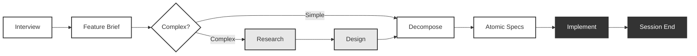

# Joycraft

<p align="center">
  
</p>

> The craft of AI development. With joy, not darkness.

## What is Joycraft?

Joycraft is a CLI tool that installs structured development skills into [Claude Code](https://docs.anthropic.com/en/docs/claude-code), [OpenAI Codex](https://openai.com/codex), and [Pi](https://github.com/earendil-works/pi-coding-agent), along with behavioral boundaries, templates, and documentation structure. It takes any project from unstructured prompting to an excellent spec-driven development system with a harness that matures alongside your project.

### The core idea

- **The product:** Skills like `/joycraft-tune`, `/joycraft-new-feature`, and `/joycraft-interview` replace unstructured prompting with spec-driven development — you interview, you write specs, the agent executes — plus a harness (boundaries, context docs, skills) that gets better as you work.
- **The experimental frontier:** For teams with the budget and infrastructure to maintain it, the `/joycraft-implement-level5` skill sets up an autonomous loop with holdout scenario testing, and on Pi the workflow can run fully headless. Powerful, but genuinely expensive to run and maintain with current models — treat it as a north star, not the next step.

### What are the levels?

[Dan Shapiro's 5 Levels of Vibe Coding](https://www.danshapiro.com/blog/2026/01/the-five-levels-from-spicy-autocomplete-to-the-software-factory/) provides the framework:

| Level | Name | What it looks like | Joycraft's role |
|-------|------|--------------------|-----------------|
| 1 | Autocomplete | Tab-complete suggestions | - |
| 2 | Junior Developer | Prompt → iterate → fix → repeat | `/joycraft-tune` assesses where you are |
| 3 | Developer as Manager | Your life is reviewing diffs | Behavioral boundaries in CLAUDE.md |
| 4 | Developer as PM | You write specs, agent writes code | `/joycraft-new-feature` + `/joycraft-decompose` |
| 5 | Software Factory | Specs in, validated software out | `/joycraft-implement-level5` (experimental) |

Most developers plateau at Level 2. Joycraft's job is to make you excellent at
Levels 3-4: spec-driven development with a well-maintained harness. Level 5 is
real — StrongDM proved it — but with current models it takes serious budget and
a team to maintain, so Joycraft treats it as an experimental north star rather
than the destination.

### Platform support

Joycraft supports **Claude Code**, **OpenAI Codex**, and **Pi** out of the box. When you run `npx joycraft init`, it opens with a quick picker — choose any combination of the three, and only the harnesses you select get installed:

```
Which AI harnesses should Joycraft install?
  claude  — Claude Code (.claude/)
  codex   — OpenAI Codex (.agents/)
  pi      — Pi (.pi/)
Harnesses [comma-separated, or "all"] (none): claude,pi
```

| Harness | Skills installed to | Invocation |
|---------|---------------------|------------|
| Claude Code | `.claude/skills/` | `/joycraft-*` |
| Codex | `.agents/skills/` (+ `AGENTS.md`) | `$joycraft-*` |
| Pi | `.pi/skills/` (+ pipeline runtime, see below) | `/skill:joycraft-*` |

All three get the same structured workflows, adapted for each tool's invocation model. A single-harness install carries **no footprint from the others** — pick `codex` only and you get `.agents/` with no `.claude/` or `.pi/` in sight. In a non-interactive run (CI, piped, no TTY) `init` installs all three so existing scripts keep working. The shared docs (`CLAUDE.md`, `AGENTS.md`, `docs/`) are written regardless of which harnesses you pick.

### Headless spec execution (Pi)

Pi is the one harness where the workflow can run **fully autonomously** — no human keystrokes between specs. Beyond the skills, `init` installs a pipeline runtime to `.pi/scripts/joycraft/` whose driver, `joycraft-implement-loop`, runs an entire feature's spec queue end to end:

```
next-spec → pi -p "/skill:joycraft-implement <spec>" → pi -p "/skill:joycraft-spec-done <spec>" → repeat
```

Each spec runs in **one fresh OS process** (`pi -p`), so the context isolation is the process boundary itself — verified, not in-conversation trickery. The loop is fail-fast (stops and names the failing spec) and runs `session-end` exactly once when the queue is exhausted.

This is what Claude Code and Codex can't do out of the box: an unattended `interview → PR` line where the machine does everything convergent in between. It is Pi-specific by design — the driver targets Pi with a BYO API key or open-weight model (Commercial/API terms, no automation restriction); pointing a consumer Claude/ChatGPT *subscription* at an automated loop would violate those tools' terms.

On Claude Code, `/joycraft-implement-feature` gets you the in-session equivalent: one interactive invocation runs the whole queue with a fresh-context **subagent** per spec — the subagent boundary plays the role of Pi's process boundary. You're at the keyboard and it's one command, so none of the headless ToS/cost caveats apply.

## What's new in 0.7 — the living harness

Through 0.6, Joycraft was excellent at *writing things down*: interviews became
briefs, briefs became specs, sessions ended with discoveries and decision-log
rows. What nothing enforced was whether any of it stayed **true** — specs could
quietly invent constraints, agents re-derived decisions the project had already
made, and the harness only ever grew. 0.7 closes that loop; the harness now
audits itself:

| | Before (≤0.6) | Now (0.7) |
|---|---|---|
| **Spec constraints** | Decompose could invent numbers/conventions that looked authoritative downstream | Every constraint carries a cite — `[src: D3]`, `[src: brief "Scope"]` — or is flagged `[src: INVENTED]` and stopped at a human gate; open decisions block decomposition entirely |
| **Design claims** | All claims read equally confident | Load-bearing claims are self-scored against fixed anchors (0/25/50/75/100); anything ≤50 is blocked from propagating until deepened or decided |
| **Prior knowledge** | Agents reasoned from scratch each phase | Research/design/decompose open with a bounded retrieval pass over `docs/context/` + `docs/discoveries/` and must cite what they reused |
| **Boundaries** | Prose rules an agent could drift past | `joycraft-harden` converts eligible rules into machine-checked deny patterns, stamped with provenance + a probation marker |
| **Harness growth** | Only ever grew | `joycraft-optimize` v2 assigns every control one of six dispositions (KEEP/ONE_HOME/LOAD_LATER/MAKE_A_CHECK/PROBATION/RETIRE); its Reaper deletes shipped feature folders only after the PR verifiably merged, and archive-moves abandoned ones |
| **Shipped features** | Folders sat forever; deleting lost the story | Session-end extracts a one-line ledger row to `docs/context/shipped.md` + marks the folder reap-eligible before the Reaper may touch it |
| **Skill surface** | All skills looked alike to discovery | Skills declare `entry: human \| agent \| situational` — human doors stay discoverable, internals get terse anti-discovery descriptions |
| **Trust** | The gates were assumed to work | Each gate was evaluated with N=3 fresh-context agent runs graded from tool-call timelines — one gate failed 2/3, got fixed, and re-passed 3/3 |

**Side effects to expect:** new files in your knowledge layer
(`docs/context/shipped.md`, `docs/context/anchors.md`,
`docs/reference/knowledge-lifecycle.md`), `(anchor: N)` annotations in design
artifacts, decompose refusing to run while a brief has an open decision, and
hardened rules being genuinely blocked at the hook layer — including for you.

Parts of this ship in the npm package today; the rest runs as a marked pilot in
Joycraft's own repo and graduates once it survives real use — the same
discipline Joycraft asks of your projects. The full before/now/side-effects
record is in [CHANGELOG.md](CHANGELOG.md).

### Upgrading to 0.7

From your project root:

```bash
npx joycraft@latest upgrade
```

What this does to an existing setup:

- **Your customizations survive.** Upgrade diffs every file it installed against
  what's on disk: unmodified files update silently, customized files show you
  the diff and ask. Nothing is overwritten without a yes (or `--yes` in CI).
- **State file moves.** `.claude/.joycraft/state.json` migrates to
  `docs/.joycraft/state.json` (gitignored, harness-neutral) automatically.
- **Session-end gains the extraction step.** The next time a feature finishes,
  it writes a `docs/context/shipped.md` ledger row and marks the brief
  `reap: eligible` — it never deletes anything.
- **Four skills gain `entry:` frontmatter** (decompose, implement, spec-done,
  session-end). Purely additive; invocation is unchanged.
- **Harness selection is honored.** A Codex-only project stays Codex-only.
- **Nothing pilots into your repo.** The 0.7 pilot ring (provenance gates,
  confidence anchors, harden, optimize v2) runs in Joycraft's own repo first;
  your project gets those pieces in a later release once they graduate.

**Or let your agent drive it.** Paste this prompt into Claude Code, Codex, or
Pi inside your project and it will run the upgrade, show you what changed, and
leave a reviewable commit:

```text
Upgrade Joycraft in this project to 0.7. Steps: (1) Create a branch
chore/joycraft-0.7. (2) Run `npx joycraft@latest upgrade` interactively —
when it shows a diff for a file I customized, summarize the diff for me in
one or two sentences and ask before accepting; never blanket-accept.
(3) After the upgrade, list every file it changed, added, or migrated
(including the docs/.joycraft/state.json move), and read CHANGELOG.md's
0.7.0 entry from the joycraft package to explain in plain terms what
changed about how my harness behaves — before vs. now, plus side effects
I should expect. (4) Confirm my harness selection and gitignore profile
were preserved, and that my CLAUDE.md/AGENTS.md customizations are intact.
(5) Run my project's test and typecheck commands to confirm nothing broke.
(6) Commit the result with message "chore: upgrade joycraft to 0.7" and
show me the diff stat — do not push or open a PR without asking.
```

## Quick Start

First, install the CLI:

```bash
npm install -g joycraft
```

Then navigate to your project's root directory and initialize:

```bash
cd /path/to/your/project
npx joycraft init
```

`init` first asks which harnesses to install (see [Platform support](#platform-support) above), then auto-detects your tech stack and creates:

- **AGENTS.md** with behavioral boundaries (Always / Ask First / Never) and correct build/test/lint commands — the single shared instruction file when more than one tool is selected
- **CLAUDE.md** — on a multi-tool install this is [Anthropic's documented import pattern](https://code.claude.com/docs/en/memory): `@AGENTS.md` plus a `## Claude Code` section for Claude-specific additions, so every tool reads one source and nothing drifts. A Claude-only install gets the classic full CLAUDE.md instead
- **20 skills** installed to the selected harnesses — `.claude/skills/` (Claude Code), `.agents/skills/` (Codex), and/or `.pi/skills/` (Pi) — see [Which skill do I need?](#which-skill-do-i-need) below
- **Pi pipeline runtime** in `.pi/scripts/joycraft/` (when Pi is selected) — the headless spec-execution driver and its helpers
- **Agent teams enabled** — when Claude Code is selected, `init` sets `CLAUDE_CODE_EXPERIMENTAL_AGENT_TEAMS=1` in `.claude/settings.json` so subagent-driven skills like `/joycraft-research` work out of the box (idempotent — it never clobbers a value you already set)
- **docs/** structure: `docs/context/` is created up front; feature work lands in `docs/features/<slug>/{brief.md, research.md, design.md, specs/}` and deferred work in `docs/backlog/` — these are created lazily by the skills that write to them. Joycraft's own upgrade state lives hidden at `docs/.joycraft/state.json` (harness-neutral, gitignored — never committed)
- **Context documents** in `docs/context/`: production map, dangerous assumptions, decision log, institutional knowledge, and troubleshooting guide
- **Templates** including atomic spec, feature brief, implementation plan, boundary framework, and workflow templates for scenario generation and autofix loops

> Pick nothing at the harness prompt and `init` installs nothing — it tells you to re-run and choose at least one harness.

**`init` only creates *missing* files.** It is safe to run on a project that already has Joycraft (or a hand-tuned `CLAUDE.md`): an existing `CLAUDE.md`, `AGENTS.md`, template, or skill file is **skipped, never regenerated** — your customizations are left untouched. Only `--force` overwrites existing files. The run summary lists what it skipped (`Skipped N file(s) (already exist, use --force to overwrite)`) so you can see exactly what was preserved. This makes `init` the right command to **fill in a private-profile clone**: a teammate who clones a `private` repo gets the committed `CLAUDE.md`/`AGENTS.md`/`docs/` but not the gitignored harness dirs — running `npx joycraft init` regenerates the missing skill files locally and leaves the committed files alone.

### Git tracking: shared vs private

By default Joycraft assumes you want to **commit** the harness so your whole team
gets the same skills and workflow. Some teams prefer to keep the harness local
and track only the docs. Choose a profile at init time:

```bash
npx joycraft init --gitignore=shared    # default — commit .claude/, .agents/, .pi/
npx joycraft init --gitignore=private   # gitignore them; track only CLAUDE.md, AGENTS.md, docs/
```

Run interactively without the flag and `init` asks (right after the harness
picker). The choice is saved, so `npx joycraft upgrade` re-applies it
automatically. To switch an existing project later (or decide from CI), pass the
same flag to upgrade: `npx joycraft upgrade --gitignore=private`. `.gitignore`
edits are append-only — Joycraft never rewrites or removes your existing lines.

| Profile | Tracked in git | Gitignored |
|---------|----------------|------------|
| `shared` (default) | `CLAUDE.md`, `AGENTS.md`, `docs/`, `.claude/skills/`, `.agents/`, `.pi/` | hidden upgrade state only (`docs/.joycraft/state.json`) |
| `private` | `CLAUDE.md`, `AGENTS.md`, `docs/` | `.claude/`, `.agents/`, `.pi/` |

> Switching an existing project to `private` only updates `.gitignore`. If
> harness files were already committed, untrack them with
> `git rm -r --cached .claude .agents .pi` (Joycraft prints this reminder and
> never runs git for you).
>
> Under `private`, the harness dirs aren't committed — so a teammate who clones
> the repo gets `CLAUDE.md`/`AGENTS.md` but no skills until they run
> `npx joycraft init` to regenerate them locally. Joycraft adds a one-line
> reminder to your generated `CLAUDE.md` and `AGENTS.md` for exactly this reason.

### Reviewable PRs: workflow docs are collapsed

Joycraft's docs are two kinds of content. Durable knowledge — `CLAUDE.md`,
`AGENTS.md`, `docs/context/` — steers every future agent run and deserves review
eyes. Workflow exhaust — feature briefs and specs, discoveries, installed
templates — is historical by the time a PR is opened (the spec was reviewed in
conversation when it was written). To keep PRs reviewable, `init` and `upgrade`
write a `.gitattributes` marking the exhaust paths `linguist-generated=true`:

```gitattributes
docs/features/** linguist-generated=true
docs/bugfixes/** linguist-generated=true
docs/discoveries/** linguist-generated=true
docs/templates/** linguist-generated=true
```

GitHub collapses these files in the Files Changed view and excludes them from
diff stats — reviewers see your code and your durable knowledge, and any
collapsed doc is one click from expanding. The write is append-only and
idempotent (your existing `.gitattributes` lines are never touched); delete any
line to opt that path back into full review.

### Supported Stacks

Node.js (npm/pnpm/yarn/bun), Python (poetry/pip/uv), Rust, Go, Swift, and generic (Makefile/Dockerfile).

Frameworks auto-detected: Next.js, FastAPI, Django, Flask, Actix, Axum, Express, Remix, and more.

## The Workflow

### Which skill do I need?

| You want to... | Use | What happens |
|---|---|---|
| Brainstorm an idea before committing to building it | `/joycraft-interview` | Free-form conversation → structured draft brief |
| Build a new feature from scratch | `/joycraft-new-feature` | Guided interview → Feature Brief → Atomic Specs |
| Understand existing code before building on it | `/joycraft-research` | Objective codebase research — facts only, no opinions |
| Align on approach before writing code | `/joycraft-design` | Design discussion → ~200-line artifact for human review |
| Break a feature into small, independent tasks | `/joycraft-decompose` | Feature Brief → testable Atomic Specs |
| Fix a bug with a structured workflow | `/joycraft-bugfix` | Reproduce → isolate → fix → verify loop |
| Implement a spec with TDD | `/joycraft-implement` | Read spec → failing tests → implement until green → wrap up → continue the queue |
| Run a feature's whole spec queue from one command | `/joycraft-implement-feature` | Fresh-context subagent per spec → fail-fast → session-end once |
| Run specs autonomously without hand-holding | `/joycraft-implement-level5` | Experimental — autofix loop + holdout scenario testing |
| Verify an implementation independently | `/joycraft-verify` | Read-only subagent checks work against the spec |
| Wrap up when a feature's specs are done | `/joycraft-session-end` | Consolidate discoveries → validate → graduate specs → ledger row → push/PR |
| Assess and mature your harness | `/joycraft-tune` | Score 7 dimensions → apply fixes → maturity roadmap |
| Audit harness overhead and prune | `/joycraft-optimize` | Six-disposition self-audit; its Reaper pass retires shipped/abandoned feature folders |
| Set up Joycraft for a team | `/joycraft-collaborative-setup` | Scaffold `docs/areas/`, owner conventions, a team CONTRIBUTING doc |

The core loop:


```mermaid
flowchart LR
    A[Interview] --> B[Feature Brief]
    B --> C{Complex?}
    C -- "Simple" --> F[Decompose]
    C -- "Complex" --> D[Research]
    D --> E[Design]
    E --> F
    F --> G[Atomic Specs]
    G --> H[Implement]
    H --> I[Session End]

    style A fill:#fff,stroke:#333,stroke-width:2px
    style B fill:#fff,stroke:#333,stroke-width:2px
    style C fill:#fff,stroke:#333,stroke-width:2px
    style D fill:#e8e8e8,stroke:#333,stroke-width:2px
    style E fill:#e8e8e8,stroke:#333,stroke-width:2px
    style F fill:#fff,stroke:#333,stroke-width:2px
    style G fill:#fff,stroke:#333,stroke-width:2px
    style H fill:#333,stroke:#333,color:#fff,stroke-width:2px
    style I fill:#333,stroke:#333,color:#fff,stroke-width:2px
```

### The Interview

The single biggest upgrade Joycraft makes is replacing prompt-iterate-fix with a structured interview. [Read the full guide →](docs/guides/interview-workflow.md)

### Research Isolation & Design Checkpoints

Objective research via context isolation and 200-line design checkpoints for human review before decomposition. [Read the full guide →](docs/guides/research-and-design.md)

### Test-First Development

Tests are the mechanism to autonomy — every spec includes a test plan, and the agent writes failing tests before implementing. [Read the full guide →](docs/guides/test-first-development.md)

### Tuning: Risk Interview & Git Autonomy

A 2-3 minute risk interview generates safety boundaries, and you choose your git autonomy level. [Read the full guide →](docs/guides/tuning.md)

### Token Discipline

Joycraft produces file artifacts at every step, so your conversation context is disposable. Clear it between phases to reduce cost and improve output quality. [Read the full guide →](docs/guides/token-discipline.md)

### Level 5: The Autonomous Loop (experimental)

Level 5 is where specs go in and validated software comes out — four GitHub Actions workflows, a separate scenarios repo, and two AI agents that can never see each other's work. It works, but budget for real token costs and ongoing scenario maintenance before committing to it. [Read the full guide →](docs/guides/level-5-autonomy.md)

### Permission Modes

You do **not** need `--dangerously-skip-permissions` for autonomous development. Claude Code offers safer alternatives. [Read the full guide →](docs/guides/permission-modes.md)

### How It Works with AI Agents

Claude Code reads CLAUDE.md, Codex and Pi read AGENTS.md — and Claude Code does **not** read AGENTS.md natively. On a multi-tool install Joycraft therefore keeps one shared AGENTS.md and writes CLAUDE.md as an `@AGENTS.md` import (Anthropic's documented pattern), so every tool reads the same instructions without duplication. [Read the full guide →](docs/guides/agent-compatibility.md)

## Upgrade

When Joycraft templates and skills evolve, update without losing your customizations:

```bash
npx joycraft upgrade
```

Joycraft tracks what it installed vs. what you've customized. Unmodified files update automatically. Customized files show a diff and ask before overwriting. Use `--yes` for CI.

`upgrade` only refreshes the harnesses you installed at init — a Codex-only project stays Codex-only and never grows a `.claude/` tree. (Projects from before harness selection existed have no recorded choice, so `upgrade` refreshes all three, preserving the old behavior.)

> **Note:** If you're upgrading from an early version, deprecated skill directories (e.g., `/joy`, `/joysmith`, `/tune`) are automatically removed during upgrade.

## Why This Exists

Most developers using AI tools are at Level 2 — and [METR's research](https://metr.org/) found they're actually slower, not faster. Joycraft packages the patterns used by teams seeing transformative results into something anyone can install. [Read the full methodology →](docs/guides/methodology.md)

## Standing on the Shoulders of Giants

Joycraft synthesizes ideas and patterns from people doing extraordinary work in AI-assisted software development:

- **[Dan Shapiro](https://x.com/danshapiro)** for the [5 Levels of Vibe Coding](https://www.danshapiro.com/blog/2026/01/the-five-levels-from-spicy-autocomplete-to-the-software-factory/) framework that Joycraft's assessment and level system is built on
- **[StrongDM](https://www.strongdm.com/)** / **[Justin McCarthy](https://x.com/BuiltByJustin)** for the [Software Factory](https://factory.strongdm.ai/): spec-driven autonomous development, NLSpec, external holdout scenarios, and the proof that 3 engineers can outproduce 30
- **[Dex Horthy](https://x.com/dexhorthy)** / **[HumanLayer](https://humanlayer.dev)** for the [RPI to CRISPY evolution](https://humanlayer.dev/blog): research isolation (hide the ticket from the researcher), the instruction budget concept (~150-200 instructions max), design discussions as high-leverage checkpoints, vertical-over-horizontal planning, and the conviction that "if your tool requires magic words, go fix the tool"
- **[Boris Cherny](https://x.com/bcherny)**, Head of Claude Code at Anthropic, for the interview → spec → fresh session → execute pattern and the insight that [context isolation produces better results](https://www.lennysnewsletter.com/p/head-of-claude-code-what-happens)
- **[Addy Osmani](https://x.com/addyosmani)** for [What makes a good spec for AI](https://addyosmani.com/blog/good-spec/): commands, testing, project structure, code style, git workflow, and boundaries
- **[METR](https://metr.org/)** for the [randomized control trial](https://metr.org/) that proved unstructured AI use makes experienced developers slower, validating the need for harnesses
- **[Nate B Jones](https://x.com/natebjones)** whose [video on the 5 Levels of Vibe Coding](https://www.youtube.com/watch?v=bDcgHzCBgmQ) made this research accessible and inspired turning Joycraft into a tool anyone can use
- **[Simon Willison](https://x.com/simonw)** for his [analysis of the Software Factory](https://simonwillison.net/2026/Feb/7/software-factory/) that helped contextualize StrongDM's approach for the broader community
- **[Anthropic](https://www.anthropic.com/)** for Claude Code's skills, hooks, and CLAUDE.md system that makes tool-native AI development possible, and the [harness patterns for long-running agents](https://www.anthropic.com/engineering/effective-harnesses-for-long-running-agents)

## Migration: Flat → Per-Feature Layout (v0.6+)

Starting in v0.6, Joycraft organizes feature artifacts into per-feature folders:

- `docs/briefs/<slug>.md` → `docs/features/<slug>/brief.md`
- `docs/research/<slug>.md` → `docs/features/<slug>/research.md`
- `docs/designs/<slug>.md` → `docs/features/<slug>/design.md`
- `docs/specs/<feature>/` → `docs/features/<slug>/specs/` (when `<feature>` matches a brief slug)

`npx joycraft upgrade` performs this migration automatically and forcefully on the first
post-upgrade run — no Y/N prompt. The CLI prints a summary of every move before applying it.
Spec directories under `docs/specs/` whose name doesn't match any brief slug (area-level specs
like bugfix folders) are left in place.

### What you'll see on the first post-upgrade run

```
Joycraft is migrating your docs/ to the new per-feature layout:

  2026-04-01-auth-redesign/
    docs/briefs/2026-04-01-auth-redesign.md → docs/features/2026-04-01-auth-redesign/brief.md
    docs/research/2026-04-01-auth-redesign.md → docs/features/2026-04-01-auth-redesign/research.md

  Left in place — area-level specs (e.g., bugfix areas):
    docs/specs/login-bugfix/

Migration complete. See the README section "Migration: Flat → Per-Feature Layout"
for context on what changed and why. If your project is a git repo, run
`git status` to inspect the moves before committing.
```

### Why forced (not opt-in)

All doc-producing skills (`joycraft-new-feature`, `joycraft-research`, `joycraft-design`,
`joycraft-decompose`, etc.) write to the new per-feature paths. Supporting both layouts
indefinitely would mean every skill carries dual-path branches; the forced migration keeps
the convention single and skills small.

### Recovering / customizing

Every move is a plain filesystem move (no `git mv`). If you want a different organization
after the migration, you can `git mv` files anywhere — Joycraft only depends on the
`docs/features/<slug>/` shape for skills it ships, not on every doc living there. Git
history follows files via `git log --follow`.

If a brief and its destination already exist (re-running upgrade after a partial migration),
the move is skipped and reported. The migration is idempotent.

## Contributing

Contributions are welcome! See [CONTRIBUTING.md](CONTRIBUTING.md) for the full guide.

The short version:

1. Fork, branch from `main`
2. `pnpm install && pnpm test --run` to verify your setup
3. Write tests first, then implement
4. `pnpm test --run && pnpm typecheck && pnpm build`
5. Open a PR (one approval required)

Look for [`good first issue`](https://github.com/maksutovic/joycraft/labels/good%20first%20issue) labels if you're new. Areas we'd especially love help with: stack detection for new languages, skill improvements, and documentation.

## License

MIT. See [LICENSE](LICENSE) for details.
