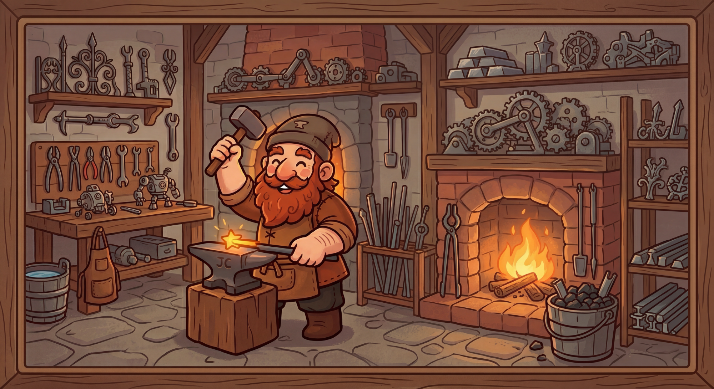
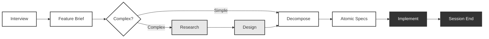

# Joycraft

<p align="center">
  
</p>

> The craft of AI development. With joy, not darkness.

## What is Joycraft?

A CLI that installs spec-driven development into [Claude Code](https://code.claude.com/docs), [OpenAI Codex](https://openai.com/codex), [Pi](https://github.com/earendil-works/pi-coding-agent), and [GitHub Copilot](https://github.com/features/copilot): skills, behavioral boundaries, templates, and a docs structure that matures with your project.

```bash
cd /path/to/your/project
npx joycraft init
```

## Contents

- [Install](#install) · [Use](#use) · [Upgrade](#upgrade)
- [Setup walkthrough](docs/guides/setup-walkthrough.md) — every step from install to first feature
- [Which skill do I need?](#which-skill-do-i-need) — the skill table and the core loop
- [What init creates](#what-init-creates)
- [Platform support](docs/guides/platform-support.md) — Claude Code, Codex, Pi, Copilot, stacks, headless Pi
- [Upgrading](docs/guides/upgrading.md) — `npx joycraft upgrade` and what's new in 0.7
- [Git tracking](docs/guides/git-tracking.md) — shared vs private profiles, reviewable PRs
- [Migration: flat → per-feature layout](docs/guides/migration-per-feature-layout.md) — the v0.6 docs move
- [The levels](docs/guides/levels.md) — Dan Shapiro's 5 Levels, where Joycraft aims, and the credits
- [Security](SECURITY.md) · [Guides](#guides) · [Why Joycraft?](#why-joycraft)
- [Contributing](CONTRIBUTING.md) · [Changelog](CHANGELOG.md) · [License](LICENSE)

## Install

```bash
cd /path/to/your/project
npx joycraft init
```

Answer two questions — which harnesses to install, and whether to commit them — and `init` does the rest: detects your stack, writes `AGENTS.md`/`CLAUDE.md` with your real build/test commands, installs the skills. Safe to re-run: it only creates missing files, never overwrites yours.

`npm install -g joycraft` if you'd rather have the command on your PATH; `npx` works without it. Every step from install to first shipped feature: [Setup walkthrough](docs/guides/setup-walkthrough.md).

## Use

Inside your AI tool, drive everything with slash commands:

```
/joycraft-setup                                     # first run — onboarding, where to begin
/joycraft-new-feature                               # interview → Feature Brief → atomic specs
/joycraft-implement-feature docs/features/<slug>/   # run the whole spec queue, TDD per spec
/joycraft-session-end                               # wrap up: validate, graduate specs, push/PR
/joycraft-tune                                      # score your harness, apply upgrades
```

Brainstorming first? `/joycraft-interview`. Fixing a bug? `/joycraft-bugfix`. The full table is at [Which skill do I need?](#which-skill-do-i-need); invocation syntax per tool is in [Platform support](docs/guides/platform-support.md).

## Upgrade

```bash
npx joycraft upgrade
```

Refreshes skills and templates for the harnesses you selected at init. Unmodified files update automatically; files you've customized show a diff and ask first (`--yes` for CI). Details and release notes: [Upgrading](docs/guides/upgrading.md).

## What init creates

- **AGENTS.md** — behavioral boundaries (Always / Ask First / Never) plus your stack's real build/test/lint commands; the single shared instruction file when more than one tool is selected
- **CLAUDE.md** — on a multi-tool install, [Anthropic's documented import pattern](https://code.claude.com/docs/en/memory): `@AGENTS.md` plus a `## Claude Code` section, so every tool reads one source. A Claude-only install gets the classic full CLAUDE.md
- **22 skills** — installed to `.claude/skills/` (Claude Code), `.agents/skills/` (Codex), `.pi/skills/` (Pi), and/or `.github/skills/` (Copilot); Pi also gets the headless pipeline runtime in `.pi/scripts/joycraft/`
- **docs/** — `docs/context/` (production map, dangerous assumptions, decision log, institutional knowledge, troubleshooting) plus templates; feature folders and `docs/backlog/` are created lazily by the skills that write to them. Joycraft's own state hides at `docs/.joycraft/state.json` (gitignored)
- **Agent teams enabled** — with Claude Code selected, `init` sets `CLAUDE_CODE_EXPERIMENTAL_AGENT_TEAMS=1` in `.claude/settings.json` so subagent-driven skills work out of the box (never clobbers a value you set)

Re-running on an existing project is covered in [Git tracking](docs/guides/git-tracking.md#re-running-init-on-an-existing-project).

## The Workflow

### Which skill do I need?

| You want to... | Use | What happens |
|---|---|---|
| Brainstorm an idea before committing to building it | `/joycraft-interview` | Free-form conversation → structured draft brief |
| Build a new feature from scratch | `/joycraft-new-feature` | Guided interview → Feature Brief → Atomic Specs |
| Understand existing code before building on it | `/joycraft-research` | Objective codebase research — facts only, no opinions |
| Align on approach before writing code | `/joycraft-design` | Design discussion → ~200-line artifact for human review |
| Break a feature into small, independent tasks | `/joycraft-decompose` | Feature Brief → testable Atomic Specs |
| Fix a bug with a structured workflow | `/joycraft-bugfix` | Reproduce → isolate → fix → verify loop |
| Implement a spec with TDD | `/joycraft-implement` | Read spec → failing tests → implement until green → wrap up → continue the queue |
| Run a feature's whole spec queue from one command | `/joycraft-implement-feature` | Fresh-context subagent per spec → fail-fast → session-end once |
| Run specs autonomously without hand-holding | `/joycraft-implement-level5` | Experimental — autofix loop + holdout scenario testing |
| Verify an implementation independently | `/joycraft-verify` | Read-only subagent checks work against the spec |
| Wrap up when a feature's specs are done | `/joycraft-session-end` | Consolidate discoveries → validate → graduate specs → ledger row → push/PR |
| Assess and mature your harness | `/joycraft-tune` | Score 7 dimensions → apply fixes → maturity roadmap |
| Audit harness overhead and prune | `/joycraft-optimize` | Six-disposition self-audit; its Reaper pass retires shipped/abandoned feature folders |
| Set up Joycraft for a team | `/joycraft-collaborative-setup` | Scaffold `docs/areas/`, owner conventions, a team CONTRIBUTING doc |

The core loop:


```mermaid
flowchart LR
    A[Interview] --> B[Feature Brief]
    B --> C{Complex?}
    C -- "Simple" --> F[Decompose]
    C -- "Complex" --> D[Research]
    D --> E[Design]
    E --> F
    F --> G[Atomic Specs]
    G --> H[Implement]
    H --> I[Session End]

    style A fill:#fff,stroke:#333,stroke-width:2px
    style B fill:#fff,stroke:#333,stroke-width:2px
    style C fill:#fff,stroke:#333,stroke-width:2px
    style D fill:#e8e8e8,stroke:#333,stroke-width:2px
    style E fill:#e8e8e8,stroke:#333,stroke-width:2px
    style F fill:#fff,stroke:#333,stroke-width:2px
    style G fill:#fff,stroke:#333,stroke-width:2px
    style H fill:#333,stroke:#333,color:#fff,stroke-width:2px
    style I fill:#333,stroke:#333,color:#fff,stroke-width:2px
```

## Guides

| Guide | What it covers |
|---|---|
| [Setup walkthrough](docs/guides/setup-walkthrough.md) | Every step from `npm install` to your first shipped feature |
| [The interview](docs/guides/interview-workflow.md) | The structured interview that replaces prompt-iterate-fix — the single biggest upgrade Joycraft makes |
| [Research and design](docs/guides/research-and-design.md) | Objective research via context isolation, and 200-line design checkpoints before decomposition |
| [Test-first development](docs/guides/test-first-development.md) | Tests are the mechanism to autonomy — every spec ships a test plan, failing tests come first |
| [Tuning: risk interview and git autonomy](docs/guides/tuning.md) | The 2–3 minute risk interview that generates your safety boundaries |
| [Token discipline](docs/guides/token-discipline.md) | Why file artifacts at every step make your conversation context disposable |
| [Permission modes](docs/guides/permission-modes.md) | Why you do **not** need `--dangerously-skip-permissions` |
| [Agent compatibility](docs/guides/agent-compatibility.md) | How CLAUDE.md and AGENTS.md stay one source across four tools |
| [Level 5: the autonomous loop](docs/guides/level-5-autonomy.md) | Experimental — workflows, holdout scenarios, and what it really costs |
| [Methodology](docs/guides/methodology.md) | Why this exists: METR's slowdown finding and the teams that beat it |

## Why Joycraft?

Unstructured prompting rots: instructions pile up in one file, the agent forgets what was decided, and every session starts from zero. Joycraft replaces it with spec-driven development — you interview, you approve the brief and the specs, the agent executes with TDD — and installs a harness (boundaries, context docs, skills) that matures alongside your project instead of decaying. The gates produce shareable artifacts (markdown + HTML) your team can answer in Notion, and every brief ends with a prompt an engineer pastes straight into their coding agent.

The name of the game is Dan Shapiro's [5 Levels of Vibe Coding](docs/guides/levels.md): Joycraft takes a project from Level 1 to a solid Level 4, with an experimental path to 5. The reasoning and the evidence live in the [Methodology guide](docs/guides/methodology.md).

## Security

Joycraft scaffolds files and never runs your code. What it reads and writes, how boundaries and deny patterns constrain your AI agent, and where to report a vulnerability: [SECURITY.md](SECURITY.md).

## Contributing

Contributions are welcome! See [CONTRIBUTING.md](CONTRIBUTING.md) for the full guide.

The short version:

1. Fork, branch from `main`
2. `pnpm install && pnpm test --run` to verify your setup
3. Write tests first, then implement
4. `pnpm test --run && pnpm typecheck && pnpm build`
5. Open a PR (one approval required)

Look for [`good first issue`](https://github.com/maksutovic/joycraft/labels/good%20first%20issue) labels if you're new. Areas we'd especially love help with: stack detection for new languages, skill improvements, and documentation.

## License

MIT. See [LICENSE](LICENSE) for details.
