# The Interview: Why It Matters

> [Back to README](../../README.md)

The single biggest upgrade Joycraft makes to your workflow is replacing the prompt-iterate-fix cycle with a **structured interview**.

Here's the problem with how most of us use AI coding tools: we open a session and start typing. "Build me a notification system." The agent starts writing code immediately. It makes assumptions about your data model, your UI framework, your error handling strategy, your deployment target. You catch some of these mid-flight, correct them, the agent adjusts, introduces new assumptions. Three hours later you have something that *kind of* works but is built on a foundation of guesses.

Joycraft flips this. Before the agent writes a single line of code, you have a conversation about *what you're building and why*.

## Two interview modes

**`/joycraft-interview`** is the lightweight brainstorm. You yap about an idea, the agent asks clarifying questions, and you get a structured summary saved to `docs/briefs/`. Good for early-stage thinking when you're not ready to commit to building anything yet. No pressure, no specs, just organized thought.

**`/joycraft-new-feature`** is the full workflow. This is the structured interview that produces a **Feature Brief** (the what and why) and then decomposes it into **Atomic Specs** (small, testable, independently executable units of work). Each spec is self-contained. An agent in a fresh session can pick it up and execute without reading anything else.

## Why this works

The insight comes from [Boris Cherny](https://www.lennysnewsletter.com/p/head-of-claude-code-what-happens) (Head of Claude Code at Anthropic): interview in one session, write the spec, then execute in a *fresh session* with clean context. The interview captures your intent. The spec is the contract. The execution session has only the spec. No baggage from the conversation, no accumulated misunderstandings, no context window full of abandoned approaches.

This is what separates Level 2 (back-and-forth prompting) from Level 4 (spec-driven development). You stop being a typist correcting an agent's guesses and start being a PM defining what needs to be built.

```mermaid
flowchart LR
    A["/joycraft-interview<br/>(brainstorm)"] --> B["Draft Brief<br/>docs/briefs/"]
    B --> C["/joycraft-new-feature<br/>(structured interview)"]
    C --> D["Feature Brief<br/>(what & why)"]
    D --> R["/joycraft-research<br/>(objective facts)"]
    R --> DS["/joycraft-design<br/>(human checkpoint)"]
    DS --> E["/joycraft-decompose"]
    E --> F["Atomic Specs<br/>docs/specs/"]
    F --> G["Fresh Session<br/>Execute each spec"]
    G --> H["/joycraft-session-end<br/>(discoveries + commit)"]

    style A fill:#e8f4fd,stroke:#369
    style C fill:#e8f4fd,stroke:#369
    style R fill:#f0e8fd,stroke:#639
    style DS fill:#f0e8fd,stroke:#639
    style F fill:#cfc,stroke:#393
    style G fill:#ffd,stroke:#993
```

